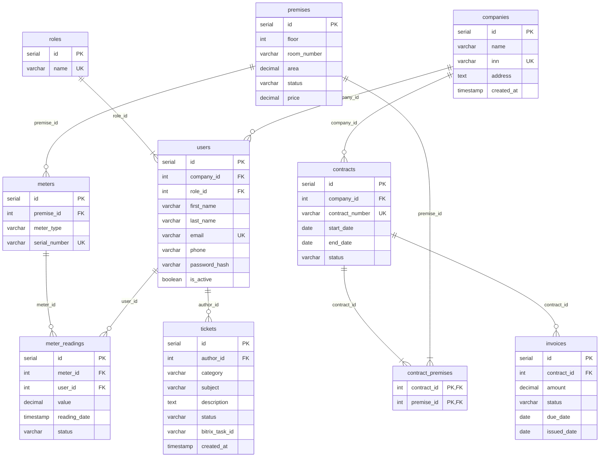

# cube27-backend

## Схема базы данных (ERD)

```mermaid
erDiagram
    roles {
        serial id PK
        varchar name UK
    }

    companies {
        serial id PK
        varchar name
        varchar inn UK
        text address
        timestamp created_at
    }

    users {
        serial id PK
        int company_id FK
        int role_id FK
        varchar first_name
        varchar last_name
        varchar email UK
        varchar phone
        varchar password_hash
        boolean is_active
    }

    premises {
        serial id PK
        int floor
        varchar room_number
        decimal area
        varchar status
        decimal price
    }

    contracts {
        serial id PK
        int company_id FK
        varchar contract_number UK
        date start_date
        date end_date
        varchar status
    }

    contract_premises {
        int contract_id PK, FK
        int premise_id PK, FK
    }

    invoices {
        serial id PK
        int contract_id FK
        decimal amount
        varchar status
        date due_date
        date issued_date
    }

    meters {
        serial id PK
        int premise_id FK
        varchar meter_type
        varchar serial_number UK
    }

    meter_readings {
        serial id PK
        int meter_id FK
        int user_id FK
        decimal value
        timestamp reading_date
        varchar status
    }

    tickets {
        serial id PK
        int author_id FK
        varchar category
        varchar subject
        text description
        varchar status
        varchar bitrix_task_id
        timestamp created_at
    }

    roles ||--|{ users : "role_id"
    companies ||--o{ users : "company_id"
    companies ||--o{ contracts : "company_id"
    contracts ||--|{ contract_premises : "contract_id"
    premises ||--|{ contract_premises : "premise_id"
    contracts ||--o{ invoices : "contract_id"
    premises ||--o{ meters : "premise_id"
    meters ||--o{ meter_readings : "meter_id"
    users ||--o{ meter_readings : "user_id"
    users ||--o{ tickets : "author_id"
```
